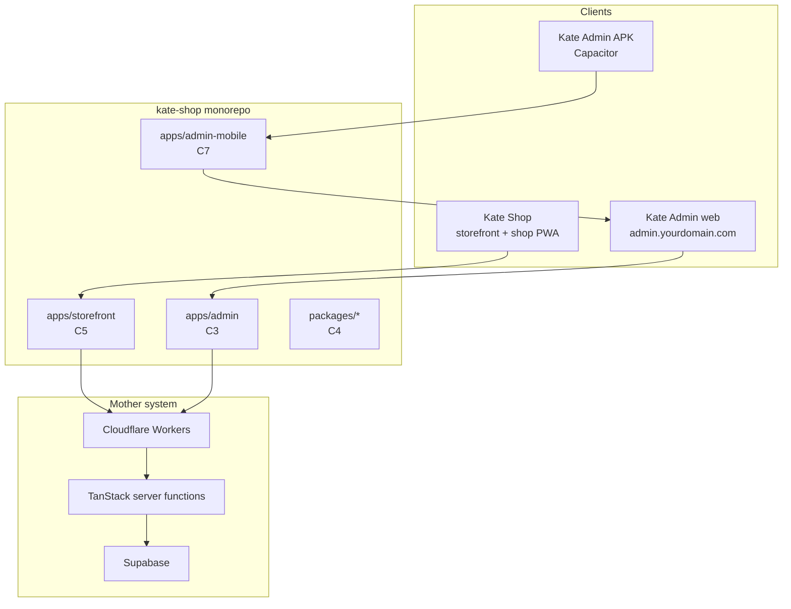

# Kate Admin app — north star

Kate Admin is a **separate staff client** of the same mother system as Kate Shop. It ships as:

1. **Web** — `https://admin.yourdomain.com` (subdomain)
2. **APK** — Capacitor shell in [`apps/admin-mobile`](../apps/admin-mobile/) loading that URL

Customers use the shop. Staff use Kate Admin. Both talk to **one Supabase project** and **one set of TanStack server functions**.

## Architecture



## Repo layout (target)

```text
kate-shop/
├── apps/
│   ├── storefront/       # public site
│   ├── admin/            # staff web
│   └── admin-mobile/     # Capacitor APK
├── packages/
│   ├── domain/
│   ├── supabase/
│   ├── ui/
│   └── api/
├── src/                  # interim monolith until C5
└── supabase/             # shared migrations
```

Today (after **C5**): `apps/storefront` is the primary shop app on port 5173; `apps/admin` on 5174. Root `npm run dev` / `npm run build` target the storefront. Legacy monolith: `npm run dev:monolith`.

## Environment contract

| Variable | Used by | Purpose |
|----------|---------|---------|
| `APP_ORIGIN` | Shop worker | Public storefront URL |
| `ADMIN_ORIGIN` | Admin worker, invite links | Staff app URL |
| `VITE_ADMIN_ORIGIN` | Admin client build | Baked into admin bundle / Capacitor config |
| `VITE_SUPABASE_*` | Both clients | Same Supabase project |
| `SUPABASE_SERVICE_ROLE_KEY` | Server only | Never in admin APK client |

Local defaults:

```bash
APP_ORIGIN=http://localhost:5173
ADMIN_ORIGIN=http://localhost:5174   # after C3
VITE_ADMIN_ORIGIN=http://localhost:5174
```

Until **C6**, staff use `http://localhost:5174` (standalone admin). Legacy `/admin` on the monolith remains via `npm run dev:monolith`.

## Backend rules (do not fork)

- Staff mutations go through server functions with `requireStaffAuth` — see [`src/lib/api/auth-middleware.server.ts`](../src/lib/api/auth-middleware.server.ts).
- The APK must **not** embed the service role key.
- Shared APIs (`orders.functions`, `payment-methods.functions`) stay in a **public** package export when split — see [ADMIN_DEPENDENCY_AUDIT.md](ADMIN_DEPENDENCY_AUDIT.md).
- Shop PWA install prompt and offline cache **must not** apply to the admin origin — see [`src/lib/pwa-install.ts`](../src/lib/pwa-install.ts).

## Supabase auth (production)

In Supabase → Authentication → URL configuration:

- **Site URL:** shop origin (`APP_ORIGIN`)
- **Redirect URLs:** `APP_ORIGIN/**`, `ADMIN_ORIGIN/**`, and mobile `com.kate.admin://login-callback` (C8)

Kate Admin install identity (C9): separate manifest + no shop service worker on `admin.*` — see [ADMIN_PWA.md](ADMIN_PWA.md).

## Blueprint chunks

| Chunk | Scope |
|-------|--------|
| **C1** | Monorepo scaffold, docs, env contract, audit |
| **C2** | `admin._layout.tsx`, lean providers, staff manifest |
| **C3** | `apps/admin` TanStack Start app ✅ |
| **C4** | `packages/*` extraction ✅ |
| **C5** | `apps/storefront`, dual-app CI ✅ |
| **C6** | Deploy `admin.yourdomain.com` ✅ |
| **C7** | Capacitor APK shell ✅ |
| **C8** | Mobile auth + deep links ✅ |
| **C9** | Staff manifest / no shop SW on admin ✅ |
| **C10** | Full route parity QA on Android ✅ |
| **C11** | CI APK artifacts ✅ |
| **C12** | Play Store scaffold + staff push ✅ |

## Scripts

| Script | Status |
|--------|--------|
| `npm run dev` | Storefront on port 5173 |
| `npm run dev:admin` | Kate Admin on port 5174 |
| `npm run dev:monolith` | Legacy monolith (shop + `/admin`) |
| `npm run build` | Storefront production build |
| `npm run build:all` | Storefront + admin builds |
| `npm run build:admin` | `apps/admin` production build |
| `npm run deploy:admin` | Admin Worker (`kate-admin`) — see [DEPLOY_ADMIN.md](DEPLOY_ADMIN.md) |
| `npm run deploy:all` | Shop + admin Workers |
| `npm run supabase:redirects` | Print Supabase auth redirect URLs (incl. mobile deep link) |
| `npm run android:admin` | Capacitor sync + run on Android (C7) |
| `npm run android:admin:sync` | Sync admin URL into native project |
| `npm run android:admin:build` | Debug APK (`assembleDebug`) |
| `npm run audit:admin` | Live — prints admin dependency summary |
| `npm run verify:admin-routes` | C10 — monolith ↔ apps/admin ↔ route catalog parity |
| `npm run test:e2e:admin:mobile` | C10 — Playwright mobile smoke (needs E2E creds) |
| `npm run build:admin-apk` | C11 — debug APK → `dist/admin-mobile/` |
| `npm run build:admin-apk:release` | C11 — signed release APK (keystore env) |
| `npm run build:admin-aab` | C12 — debug AAB (Play Store format) |
| `npm run build:admin-aab:release` | C12 — signed release AAB |
| `npm run upload:play-store` | C12 — Play upload stub (checklist) |
| `npm run db:c12` | C12 — staff push tables |

## Related docs

- [DEPLOY.md](DEPLOY.md) — dual-worker deploy notes
- [ENVIRONMENT.md](ENVIRONMENT.md) — full env matrix
- [PWA.md](PWA.md) — shop install only; admin is online-only
- [ADMIN_PWA.md](ADMIN_PWA.md) — Kate Admin manifest + SW policy (C9)
- [ADMIN_MOBILE_QA.md](ADMIN_MOBILE_QA.md) — C10 route parity matrix + device checklist
- [ADMIN_APK_RELEASE.md](ADMIN_APK_RELEASE.md) — C11 CI APK artifacts + versioning
- [ADMIN_PLAY_STORE.md](ADMIN_PLAY_STORE.md) — C12 AAB + Play Console scaffold
- [ADMIN_STAFF_PUSH.md](ADMIN_STAFF_PUSH.md) — C12 FCM order alerts
- [ADMIN_DEPENDENCY_AUDIT.md](ADMIN_DEPENDENCY_AUDIT.md) — routes, components, API map
