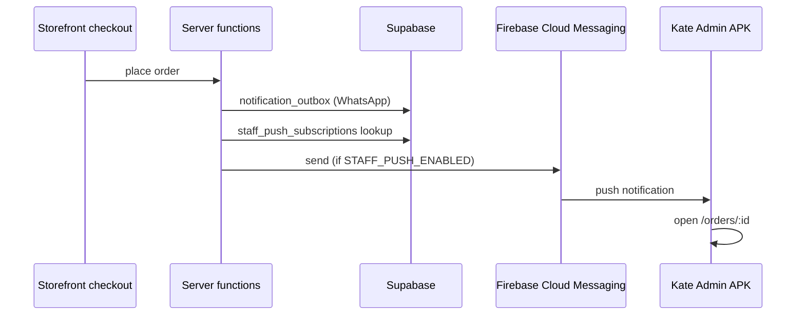

# Kate Admin — staff push (C12)

Foundation for **new-order push alerts** to staff on the Kate Admin APK. Silent until Firebase and server env are configured.

## Architecture



- **APK path:** Capacitor `@capacitor/push-notifications` + FCM token registration
- **Web admin:** registration scaffold only (`platform: web` reserved for future web push)
- **C9 policy:** shop service worker is evicted on admin — web push would need a separate push-only SW later

## Enable push

### 1. Firebase project

1. Firebase Console → Add Android app → `com.kate.admin`
2. Download `google-services.json` → `apps/admin-mobile/android/app/google-services.json`
3. Cloud Messaging → copy **Server key** (legacy) or migrate to HTTP v1 later

### 2. Server env (Worker / `.env`)

```bash
STAFF_PUSH_ENABLED=true
FCM_SERVER_KEY=your_fcm_server_key
```

Add to Cloudflare Worker secrets for production admin deploy.

### 3. Database migration

```bash
npm run db:c12
```

Creates `staff_push_subscriptions` and `staff_push_log`.

### 4. Rebuild APK

```bash
npm run android:admin:sync
ADMIN_ORIGIN=https://admin.yourdomain.com npm run build:admin-apk:release
```

Install on a device, sign in as staff with **orders.view**, accept notification permission.

## Behaviour

| Event               | Staff push                                                |
| ------------------- | --------------------------------------------------------- |
| `order_placed`      | Yes — all enabled FCM tokens for users with `orders.view` |
| `payment_confirmed` | No (future)                                               |
| `order_shipped`     | No (future)                                               |

Notification payload includes:

- `path` — `/orders/<uuid>` (in-app navigation)
- `deepLink` — `com.kate.admin://orders/<uuid>`
- `orderId` — order UUID

Tapping a notification opens the order detail screen.

## Deep links

Android intent filter: `com.kate.admin://orders/<orderId>`

Helpers in `@kate/domain/staff-mobile-links`.

## API (staff-authenticated)

| Function                 | Purpose                           |
| ------------------------ | --------------------------------- |
| `registerStaffPushToken` | Upsert FCM token for current user |
| `setStaffPushEnabled`    | Opt out / disable token           |
| `getStaffPushStatus`     | List registered devices           |

## Observability

`staff_push_log` records send attempts (staff with `orders.view` can read).

Invalid tokens (`NotRegistered`) are auto-disabled.

## Troubleshooting

| Symptom              | Check                                                           |
| -------------------- | --------------------------------------------------------------- |
| No permission prompt | Native APK only; `google-services.json` present                 |
| Token not saved      | Staff signed in; migration applied                              |
| No push on new order | `STAFF_PUSH_ENABLED` + `FCM_SERVER_KEY` on server               |
| Tap does nothing     | `StaffMobileAuthBridge` + `StaffPushRegistration` in admin root |

## Future

- Web push for admin subdomain (minimal SW)
- HTTP v1 FCM with service account
- Rich notifications (order total, item count)
- Play Store production track — [ADMIN_PLAY_STORE.md](ADMIN_PLAY_STORE.md)
